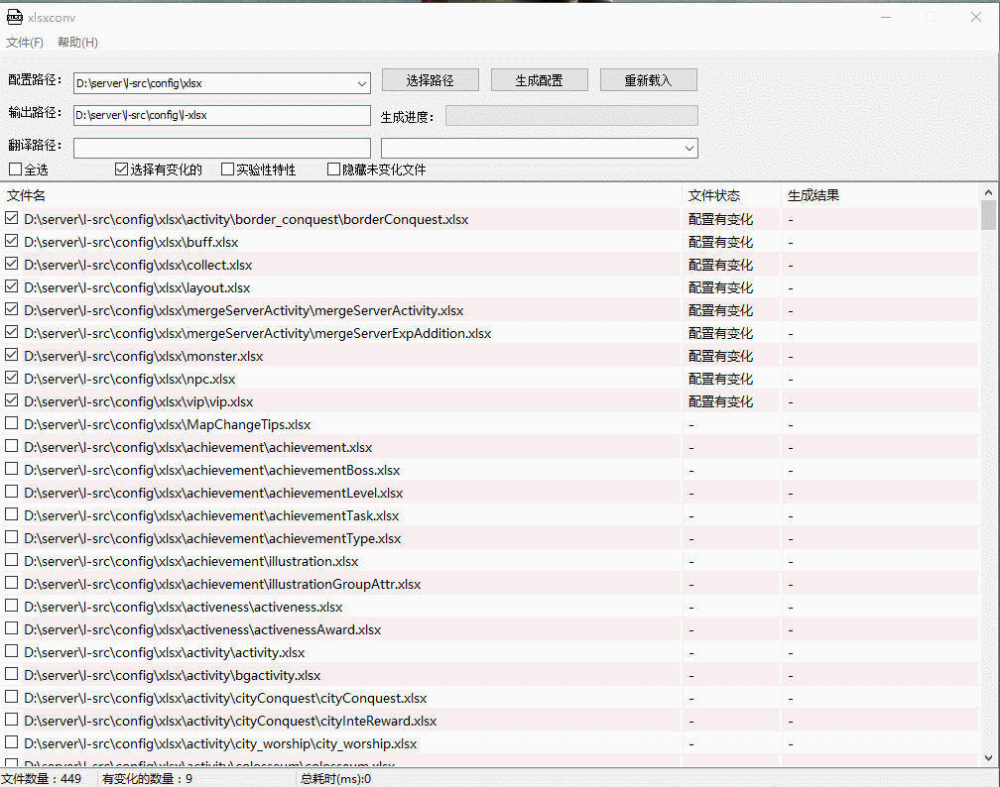

## xlsx生成器

### 简介
使用`gitee.com/ying32/govcl/vcl` UI库进行开发。本项目是我之前的[命令行导表工具](https://github.com/shuimu98/domi-lab/tree/master/golang/xlsx2lua)的GUI版本，也算是一个练手的项目。

### 安装

需要安装`rsrc`工具。然后运行`build.bat`，最后使用`Enigma Virtual Box`打包dll和exe，封装成一个exe，方便携带。

